## 项目说明

#### 转react-native也有一年多了(前两年一直在用vue)，一直在做混合APP开发，半年前做了一个纯rn的项目，迭代了两个版本，由于受市场影响，公司将其下线了，个人抽时间将项目的基本架构的代码重构了一遍，为了自我提升独搭建项目以及架构的能力(独立开发纯rn项目的能力)，现将代码分享出来，望和大家一起学习。项目中部分组件的封装适用与市场上的绝大多数的项目—— eg:登陆注册输入框、导航、提示框、加载动画、高阶组件、webAPI…… 展示数据都是静态的，部分页面的组件已经封装好，也受制于数据的限制就不继续，也希望大家体谅，主要目的是共大家学习和参考

    一路采坑走来确实有不少收获，希望可以和大家一起学习和成长，当然，如果对您有帮助，也请你不要吝啬给个 star

### 测试版本的下载地址
>  https://fir.im/5n14    安卓的下包地址

>  https://fir.im/jtas      IOS下包地址

>  密码: bixia2018

>  默认注册手机号: 17886521983

>  邀请码: 085396

>  密码：hb1234

### 技术栈
react + react-native + mobx + react-navigation + lottie-react-native + react-native-animatable + react-native-linear-gradient + react-native-root-siblings + react-native-permissions 等

### 项目运行

* react version 16.3.1
* react-native version 0.55.4
* https://github.com/15826954460/BXStage.git
* cd RENleProject
* npm/cnpm install , ios 系统建议 yarn install
* xcode/android Studio 打开项目运行

###
    任何问题欢迎在 github 上提 issues，一起交流和学习

### 关于第三方库的 xcode 以及 Android Studio 配置参考链接如下

>  lottie-react-native  参见  https://www.npmjs.com/package/lottie-react-native

>  CameraRoll 配置参见  http://www.hangge.com/blog/cache/detail_1615.html

>  mobx 的关于装饰器语法的支持 0.56.0 的版本自带有问题，还请降到0.56.0以下或是升级到更高的版本

>  react-native-splash-screen  参见 https://www.jianshu.com/p/4540ac17dfd4

>  react-native-permissions 关于调用拍照功能的第三方库  https://github.com/react-community/react-native-image-picker/blob/master/docs/Install.md

### 部分效果显示(设计图)

#### 关于登陆注册部分页面
 
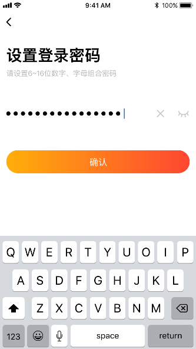 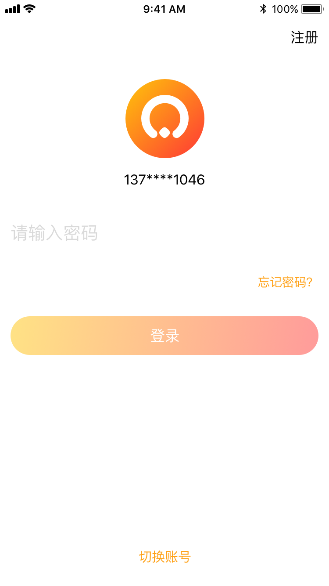
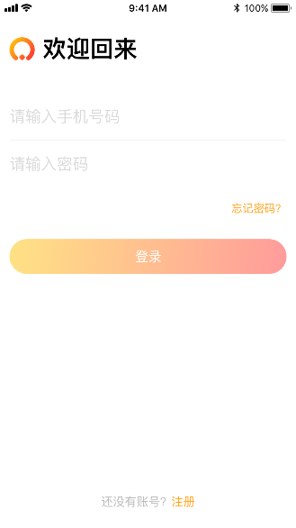 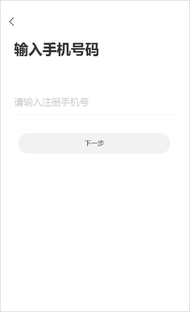

#### 关于我的分期效果部分页面
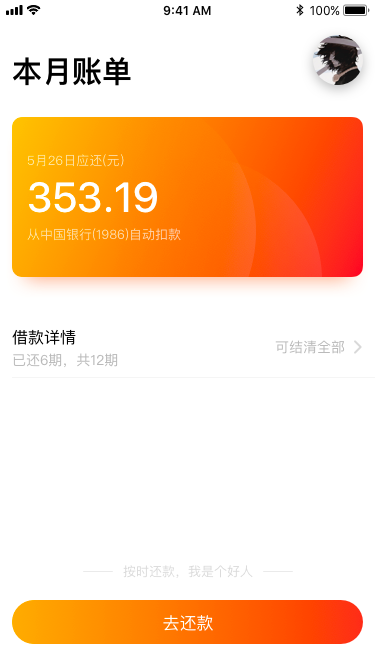 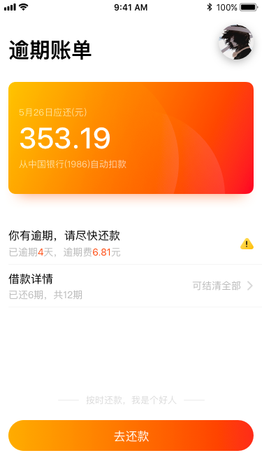
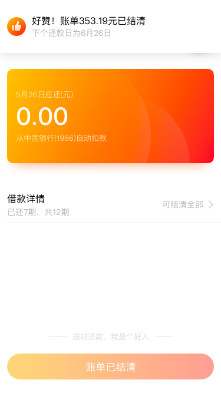 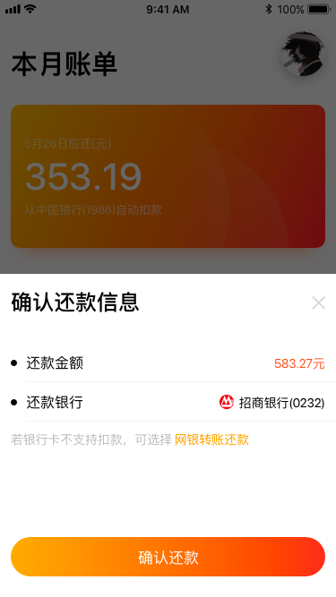

#### 关于我的页面下的部分页面
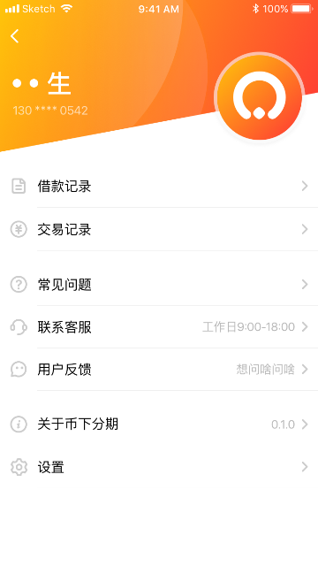 
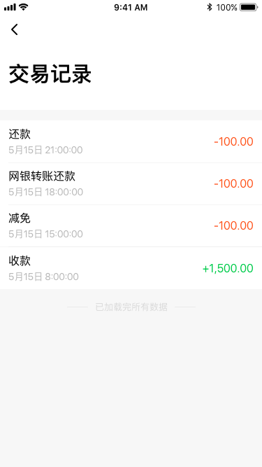 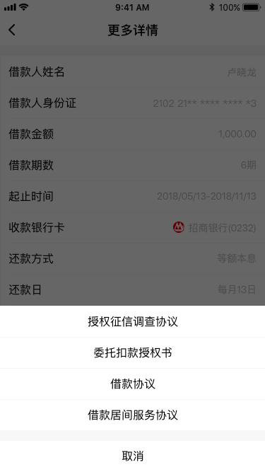

#### 关于用户反馈部分页面
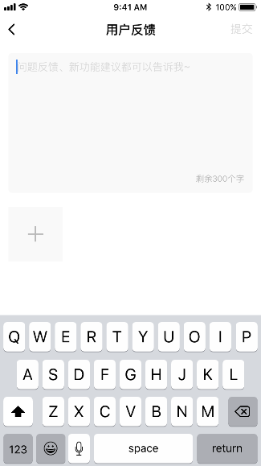 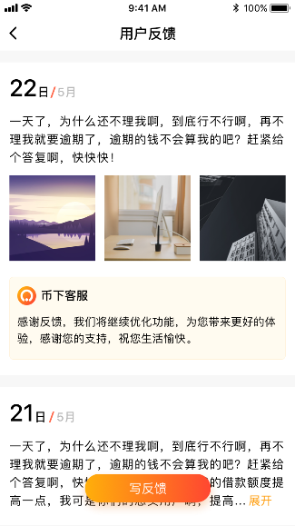
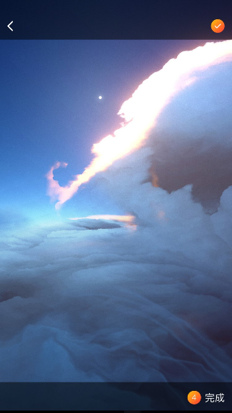 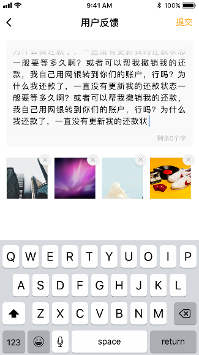
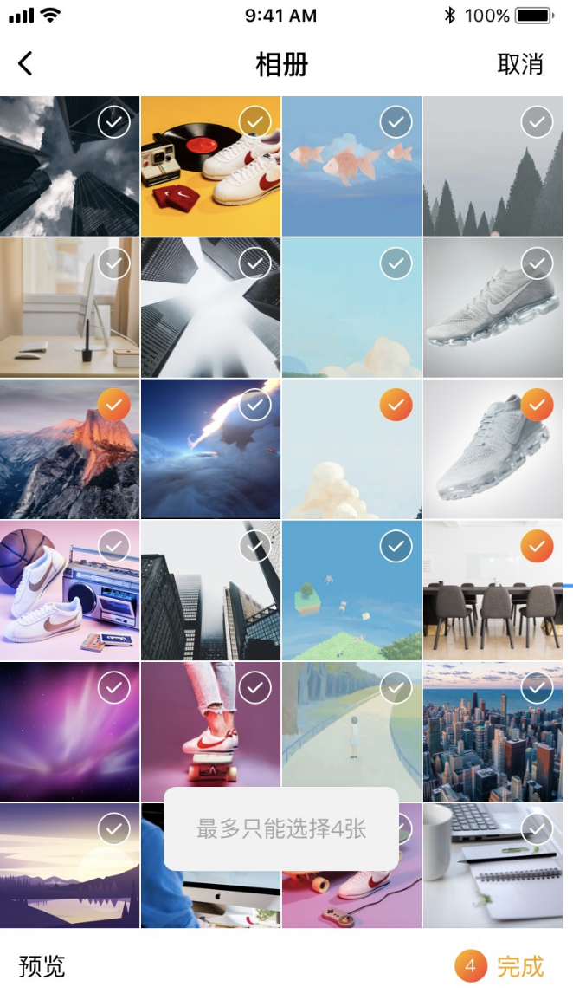

### 后续工作

>  接下来会对自定义下拉刷新组件的封装 变成通用的自定义组件

