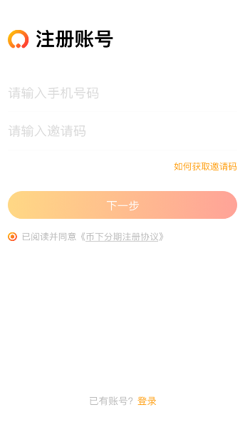

## 项目说明

## 转react-native也有一年多了(前两年一直在用vue)，之前一直在做混合APP开发，半年前做了一个纯rn的项目，迭代了两个版本，由于受市场影响，公司将其下线了，个人抽时间将项目的基本架构的代码重构了一遍，为了自我提升独搭建项目以及架构的能力，现将代码分享出来，望和大家一起学习。项目中部分组件的封装使用与市场上的绝大多数的项目—— eg:登陆注册输入框、导航、提示框、加载动画、高阶组件、webAPI……
    一路肚子采坑走来确实有不少收获，希望可以和大家一起学习和成长，当然，如果对您有帮助，也请你不要吝啬 给个 star

### 技术栈
react + react-native + mobx + react-navigation + lottie-react-native + react-native-animatable + react-native-linear-gradient + react-native-root-siblings + react-native-permissions 等

## 项目运行

* https://github.com/15826954460/BXStage.git
* cd RENleProject
* npm/cnpm install , ios 系统建议 yarn install
* xcode/android Studio 打开项目运行

## 任何问题欢迎在 github 上提 issues，一起交流和学习

关于第三方库的 xcode 以及 Android Studio 配置参考链接如下

lottie-react-native  参见  https://www.npmjs.com/package/lottie-react-native

CameraRoll 配置参见  http://www.hangge.com/blog/cache/detail_1615.html

mobx 的关于装饰器语法的支持 0.56.0 的版本自带有问题，还请降到0.56.0以下或是升级到更高的版本

react-native-splash-screen  参见 https://www.jianshu.com/p/4540ac17dfd4

react-native-permissions 关于调用拍照功能的第三方库  https://github.com/react-community/react-native-image-picker/blob/master/docs/Install.md

## 效果显示(设计图)

#### 城市选择及登陆

#### 商家菜单及购物车

#### 搜索和订单页

#### 确认订单和重置密码

#### 个人中心和添加地址

> 接下来会对自定义通用的的下拉刷新组件的封装

