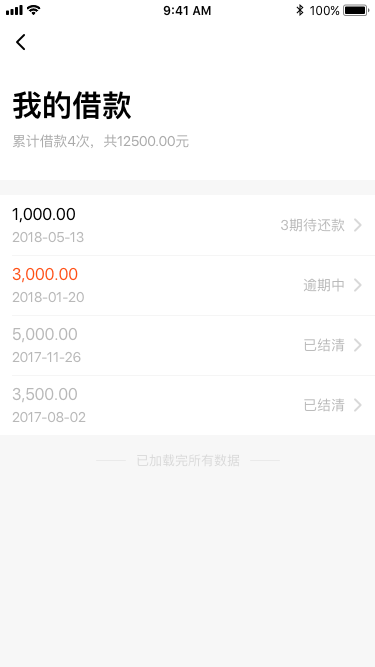

## 项目说明

#### 转react-native也有一年多了(前两年一直在用vue)，一直在做混合APP开发，半年前做了一个纯rn的项目，迭代了两个版本，由于受市场影响，公司将其下线了，个人抽时间将项目的基本架构的代码重构了一遍，为了自我提升独搭建项目以及架构的能力(独立开发纯rn项目的能力)，现将代码分享出来，望和大家一起学习。项目中部分组件的封装适用与市场上的绝大多数的项目—— eg:登陆注册输入框、导航、提示框、加载动画、高阶组件、webAPI…… 展示数据都是静态的，部分页面的组件已经封装好，也受制于数据的限制就不继续，也希望大家体谅，主要目的是共大家学习和参考

    一路采坑走来确实有不少收获，希望可以和大家一起学习和成长，当然，如果对您有帮助，也请你不要吝啬给个 star

### 测试版本的下载地址
>  https://fir.im/5n14    安卓的下包地址

>  https://fir.im/jtas      IOS下包地址

>  密码: bixia2018

>  默认注册手机号: 17886521983

>  邀请码: 085396

>  密码：hb1234

### 技术栈
react + react-native + mobx + axios + es6 + react-navigation + lottie-react-native + react-native-animatable + react-native-linear-gradient + react-native-root-siblings + react-native-permissions 等

### 项目运行

* react version 16.3.1
* react-native version 0.55.4
* https://github.com/15826954460/BXStage.git
* cd RENleProject
* npm/cnpm install , ios 系统建议 yarn install
* xcode/android Studio 打开项目运行

###
    任何问题欢迎在 github 上提 issues，一起交流和学习

### 关于第三方库的 xcode 以及 Android Studio 配置参考链接如下

>  lottie-react-native  参见  https://www.npmjs.com/package/lottie-react-native

>  CameraRoll 配置参见  http://www.hangge.com/blog/cache/detail_1615.html

>  mobx 的关于装饰器语法的支持 0.56.0 的版本自带有问题，还请降到0.56.0以下或是升级到更高的版本

>  react-native-splash-screen  参见 https://www.jianshu.com/p/4540ac17dfd4

>  react-native-permissions 关于调用拍照功能的第三方库  https://github.com/react-community/react-native-image-picker/blob/master/docs/Install.md

### 项目目录结构
```

├── app
│    └── components
│           ├── BottomText                               // 底部登陆注册切换文案组件
│           │             └── BottomText.js
│           ├── HOC                                      // 高阶组件
│           │     ├── HOCCNavigation.js                  // 全局导航组件
│           │     ├── HOCcontext.js                      // 获取上下文组件
│           │     ├── HOCNavigationEvents.js             // 页面焦点事件组件
│           │     └── HOCOnscroll.js                     // 滚动改变导航透明度组件
│           ├── ListItem
│           │     └── ListItem                           // FlatList item组件
│           ├── pullRefresh                              // 下拉刷新
│           │     ├── pullRefresh.ios.js
│           │     └── pullRefresh.android.js
│           ├── CActionSheet                             // 调用相册组件
│           ├── CAlert                                   // 弹框组件
│           ├── CBottomGradientButton                    // 全局底部按钮封装组件
│           ├── CGradientButton                          // 全局按钮组件
│           ├── CLoading                                 // loadding 组件
│           ├── CNavigation                              // 导航组件
│           ├── CNotice                                  // 顶部提示组件
│           ├── CNoticeBottom                            // 底部弹层组件
│           ├── CStatusBar                               // 状态栏组件
│           ├── CTabIcon                                 // 底部切换tab组件
│           ├── CTextInput                               // 输入框组件
│           ├── CToast                                   // toast 提示组件
│           ├── CTouchableOpacity                        // 点击按钮的简易封装
│           └── CTouchableWithoutFeedback
│
├── designImage                                          // 设计效果图
├── images                                               // 项目图片
├── json                                                 // lottie动画文件
├── pages
│     ├── errorPage                                      // 一些错误页面
│     │     ├── empty.js
│     │     ├── morePerson.js
│     │     └── netError.js
│     ├── installment                                    // 分期
│     │     └── index.js
│     ├── loginAndRegister                               // 登陆注册相关
│     │     ├── index.js
│     │     ├── login.js
│     │     ├── register.js
│     │     ├── settingLoginPassword.js
│     │     ├── validationCode.js
│     │     ├── validationCard.js
│     │     └── validationTelephone.js
│     ├── loginOut                                       // 退出登陆
│     │     └── index.js
│     ├── modifyLoginPassword                            // 修改密码
│     │     └── index.js
│     ├── my                                             // 我的
│     │     ├── accountInfo
│     │     │      ├── index.js
│     │     │      └── rename.js                         // 修改用户名
│     │     ├── commonProblem                            // 常见问题
│     │     │      ├── index.js
│     │     │      ├── problemType.js
│     │     │      └── problemList.js
│     │     ├── myLoan                                   // 我的借款
│     │     │      ├── index.js
│     │     │      ├── loanDetail.js
│     │     │      └── moreDetail.js
│     │     ├── setting.js                               // 设置
│     │     │      └── index.js
│     │     ├── tradeRecord.js                           // 交易记录
│     │     │      └── index.js
│     │     ├── userFeedBack                             // 用户反馈
│     │     │      ├── feedBackCell.js
│     │     │      ├── hasFeesBack.js
│     │     │      └── noFeedBack.js
│     │     └── index
│     ├── photo                                          // 关于相册
│     │     ├── mobx
│     │     │      └── mobx.js                           // mobx
│     │     ├── choose.js                                // 选择图片
│     │     ├── index.js                                 // 图片分组
│     │     └── preview                                  // 图片预览
│     └── testView                                       // 测试页面
├── store                                                // 关于本地储存以及一些配置
│     ├── configData.js
│     ├── data.js
│     ├── routers.js
│     └── storageData.js
├── styles                                               // 全局样式相关的组件
│    ├── layout.js
│    └── size.js
├── utils
│    ├── aboutIdCard.js                                  // 身份验证
│    ├── bouncedUtils.js                                 // 关于弹框的调用工具统一封装管理
│    ├── curve.js                                        // 动画相关
│    ├── staticPage.js                                   // 静态页面生成的工具方法
│    ├── transitionconfig.js                             // 动画相关
│    ├── util.js                                         // 全局工具方法
│    └── webAPI.js                                       // wapAPI
└──
```

###
    ### 部分效果显示(设计图)

#### 关于登陆注册部分页面
 
 
 

#### 关于我的分期效果部分页面
 
 

#### 关于我的页面下的部分页面
 
 

#### 关于用户反馈部分页面
 
 


### 后续工作

>  自定义下拉刷新组件的封装
>  关于页面的渲染相关的优化

